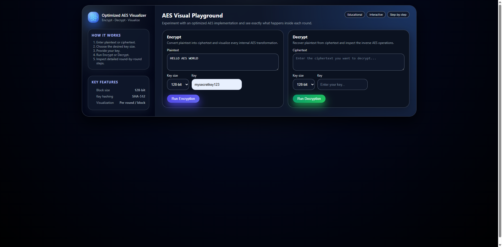
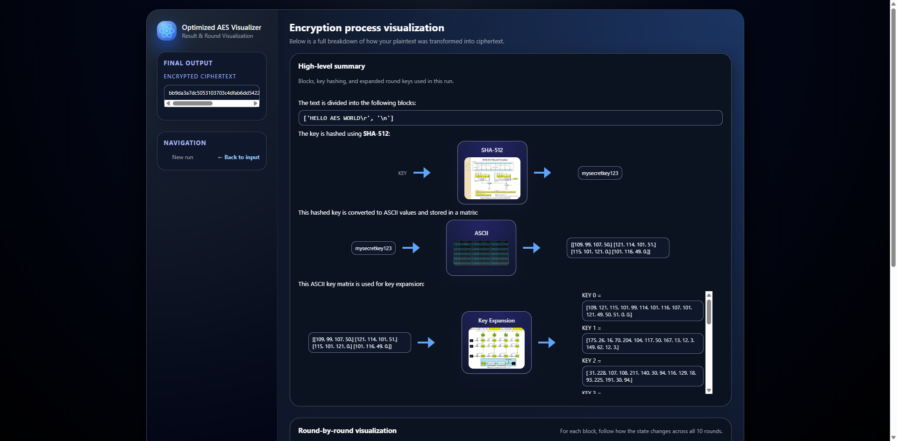

# Optimized AES Visualizer

An optimized implementation and visual representation of the Advanced Encryption Standard (AES), with a customized modern UI and detailed round-by-round visualization.

> **Note / Attribution**  
> This repository is a customized version based on:  
> - The AES implementation by **Thomas Dixon** (MIT License, see `LICENSE`), and  
> - The original project **Optimized AES Visualizer by tiwarishubham635**:  
>   https://github.com/tiwarishubham635/Optimized-AES-Visualizer  
>
> In this fork, the UI has been redesigned and the visualization layout has been adjusted, while keeping the core AES logic and process explanation.

---

## 🔗 Deployed Link (original project)

Deployed link of the original project (if still active):  
http://optimizedaesvisualizer.pythonanywhere.com

You can also run this fork locally by following the steps in the **How to run** section below.

---

## 🖼 Screenshots

**Home page (encryption / decryption input):**



**Result page (round-by-round visualization):**



---

## ✔ Description

This project implements an optimized version of AES with a 128-bit block size **without any restriction on key length**.  
The key can even be as small as a single character.

Key points of the implementation:

- Uses a **hashed key** for encryption and decryption, via the standard **SHA-512** hashing algorithm.
- Includes an **improvised ShiftRows transformation** in the AES round.
- Provides a **visual representation** of the internal AES process: key hashing, key expansion, round transformations, and block-level operations.
- Improves the Avalanche effect of AES from **49.625% to 50.1%** for the given test pairs.

---

## ✔ Salient Features

- 🎨 **Attractive and responsive UI** (redesigned layout and styling in this fork)
- ⚡ **High speed** encryption and decryption
- 🔐 **Highly secure** hashing and encryption algorithms
- 📈 **Improved efficiency** over standard AES for the given setup
- 👀 **Interactive visual representation** of:
  - Key hashing (SHA-512)
  - Key expansion per round
  - Block-wise ASCII matrices
  - Round transformations (SubBytes, ShiftRows, MixColumns, AddRoundKey / inverse operations)

---

## ✔ How It Works

1. On the main page, choose whether you want to **Encrypt** or **Decrypt**.
2. For **encryption**:
   - Enter the **plaintext**.
   - Select the **key size** (128 / 192 / 256 bit).
   - Enter the **key** (any length).
   - Click **Encrypt**.
3. For **decryption**:
   - Enter the **ciphertext**.
   - Select the same **key size** used for encryption.
   - Enter the same **key**.
   - Click **Decrypt**.
4. The result page will display:
   - The final **ciphertext** or **recovered plaintext**.
   - How the text is divided into **blocks**.
   - How the **key is hashed** using SHA-512.
   - The **ASCII key matrix** and **key expansion** (round keys).
   - For each block, the **round-by-round transformations** with diagrams and animations:
     - SubBytes / InvSubBytes  
     - (Improvised) ShiftRows / InvShiftRows  
     - MixColumns / InvMixColumns  
     - AddRoundKey  

---

## ✔ Technologies Used

- **Python**
- **Flask**
- **HTML**
- **CSS**

---

## ✔ How to Run Locally

1. **Clone this fork**

   ```bash
   git clone https://github.com/Hongxin-lin615/Optimized-AES-Visualizer.git
   cd Optimized-AES-Visualizer

